## Gold Standard Hotspots 

### Candidate 1
This candidate is located near the disrupting Pisces I dwarf galaxy. However, the RR Lyrae does not appear to be a confirmed member of Pisces I and the color--magnitude diagram and RR Lyrae parallax distance are more consistent with a closer object (D ~ 20 kpc; Molnár et al. [2015](https://academic.oup.com/mnras/article/452/4/4283/1065787)). 


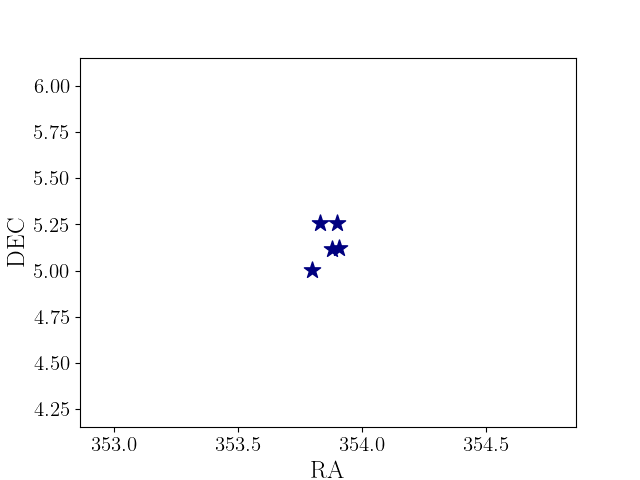 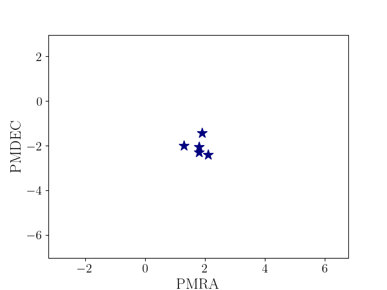

[Data File](https://github.com/edarragh/edarragh.github.io/blob/main/2_corrected.csv)

### Candidate 2
This candidate appears near the Styx Stream, which has been interpreted as the tidal tail of the disrupting Boötes III dwarf galaxy (Carlin & Sand [2018](https://iopscience.iop.org/article/10.3847/1538-4357/aad8c1)). However, the average proper motion is inconsistent with the previously measured value for the stream and the stars shown in the color--magnitude diagram are fainter than expected for an object at 45 kpc (Grillmair [2009](https://iopscience.iop.org/article/10.1088/0004-637X/693/2/1118)).


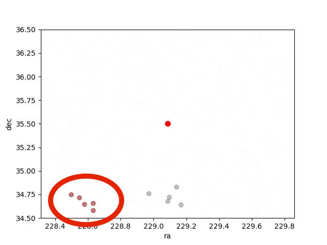 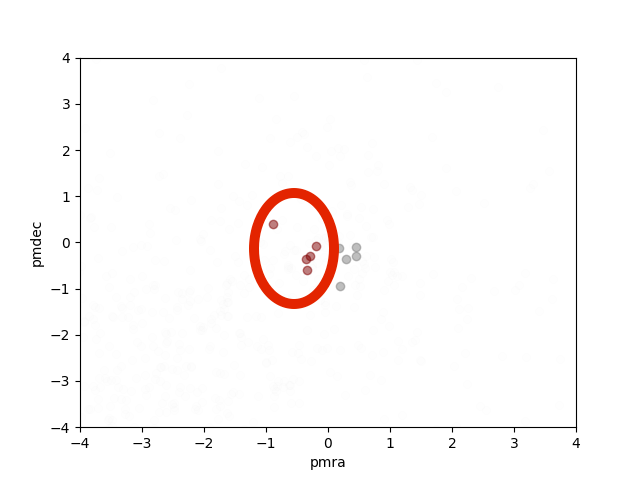

[Data File](https://github.com/edarragh/edarragh.github.io/blob/main/20_corrected.csv)


### Candidate 3 
This candidate is likely associated with the Sagittarius stream. The RR Lyrae has been determined to be a member of the stream with high probability (Ramos et al. [2020](https://www.aanda.org/10.1051/0004-6361/202037819)), and distance estimated from the color--magnitude diagram (around 50 kpc) is consistent with the prediction from (Law & Majewski [2010](https://iopscience.iop.org/article/10.1088/0004-637X/714/1/229)). The proper motion values are consistent with the Sagittarius stream measurements from (Antoja et al. [2020](https://www.aanda.org/articles/aa/abs/2020/03/aa37145-19/aa37145-19.html)), which predicts μ = 1.0 mas/yr. 

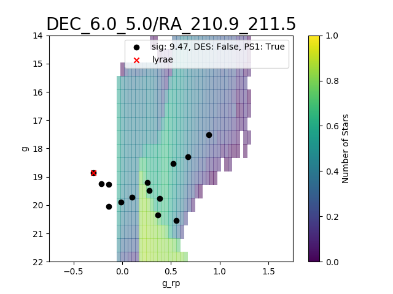
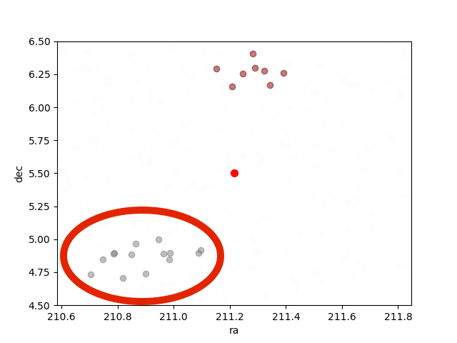 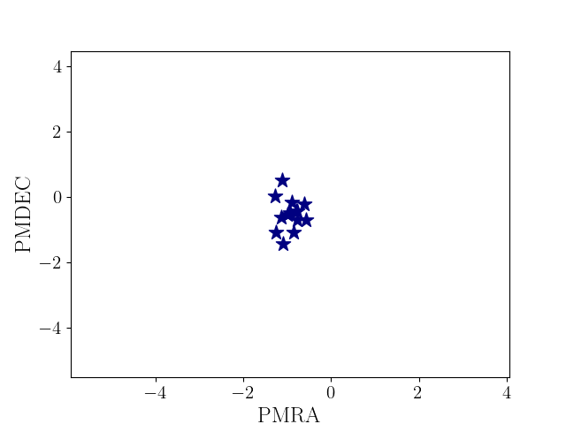

[Data File](https://github.com/edarragh/edarragh.github.io/blob/main/31_corrected.csv)


### Candidate 4
This candidate is likely associated with the Sagittarius stream. The RR Lyrae has been determined to be a member of the stream with high probability (Ramos et al. [2020](https://www.aanda.org/10.1051/0004-6361/202037819)), and distance estimated from the color--magnitude diagram (around 50 kpc) is consistent with the prediction from (Law & Majewski [2010](https://iopscience.iop.org/article/10.1088/0004-637X/714/1/229)). The proper motion values are consistent with the Sagittarius stream measurements from (Antoja et al. [2020](https://www.aanda.org/articles/aa/abs/2020/03/aa37145-19/aa37145-19.html)), which predicts μ = 1.0 mas/yr.
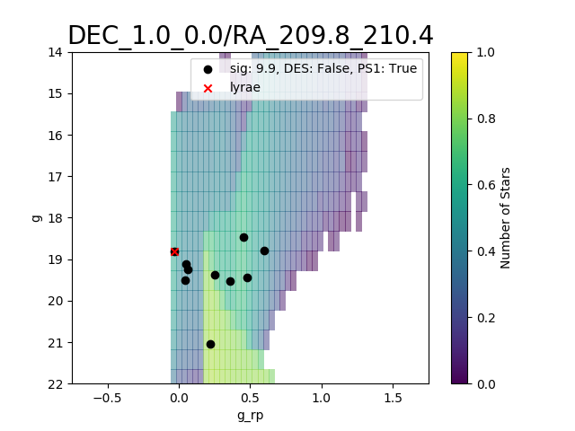
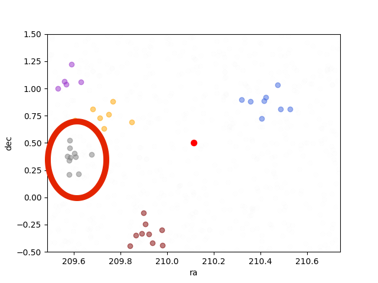 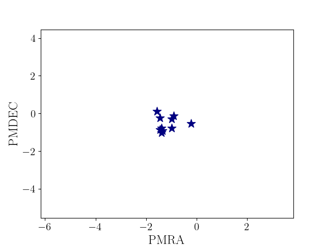

[Data File](https://github.com/edarragh/edarragh.github.io/blob/main/33_corrected.csv)


### Candidate 5
This candidate appears near the GD-1 stream at D = 8 kpc (de Boer et al. [2018](https://academic.oup.com/mnras/article-abstract/477/2/1893/4935192?redirectedFrom=fulltext)). However, the color--magnitude diagram is more consistent with an intermediate distance (around 25 kpc), and the RR Lyrae does not appear to be a known associate (Sesar et al. [2013](https://iopscience.iop.org/article/10.1088/0004-6256/146/2/21)).
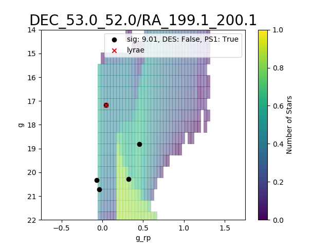
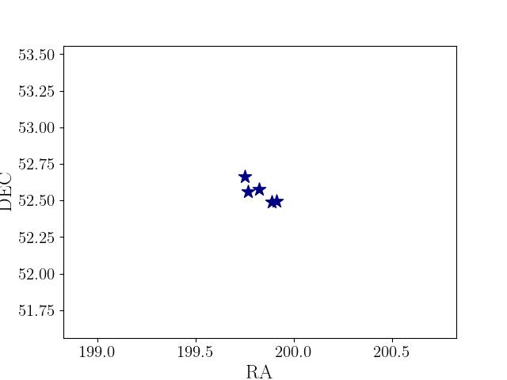 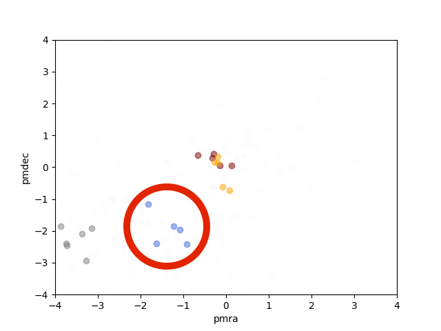

[Data File](https://github.com/edarragh/edarragh.github.io/blob/main/41_corrected.csv)


### Candidate 6
This candidate appears near the GD-1 stream at D = 8 kpc (de Boer et al. [2018](https://academic.oup.com/mnras/article-abstract/477/2/1893/4935192?redirectedFrom=fulltext)). However, the color--magnitude diagram is more consistent with an intermediate distance (around 25 kpc), and the RR Lyrae does not appear to be a known associate (Sesar et al. [2013](https://iopscience.iop.org/article/10.1088/0004-6256/146/2/21)).
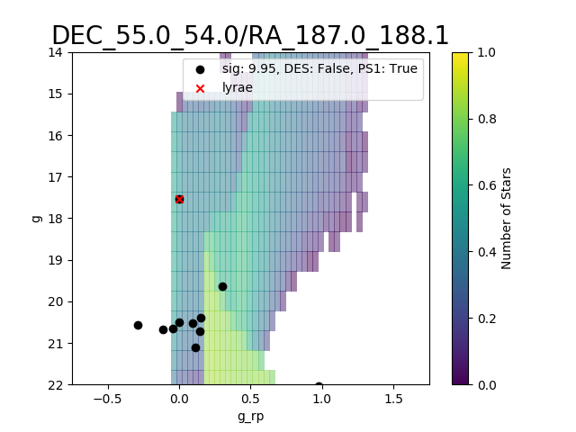
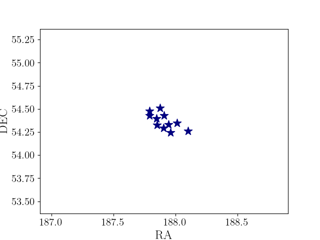 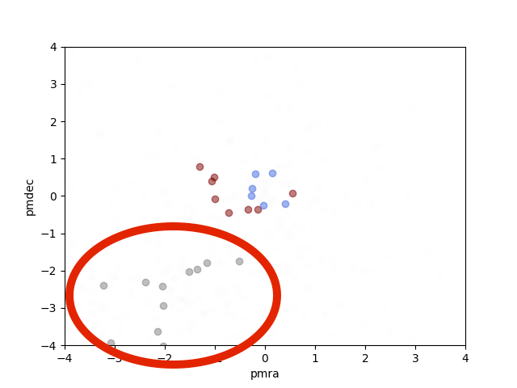

[Data File](https://github.com/edarragh/edarragh.github.io/blob/main/58_corrected.csv)


### Candidate 7
This candidate appears near both the Lethe and Sagittarius streams. It is likely associated with the Sagittarius stream as the RR Lyrae has been determined to be a member of the stream with high probability (Ramos et al. [2020](https://www.aanda.org/10.1051/0004-6361/202037819)). However, the color--magnitude diagram does not strongly favor or disfavor association with the Sagittarius Stream, which is expected to be at a distance of 30 kpc in this region (Law & Majewski [2010](https://iopscience.iop.org/article/10.1088/0004-637X/714/1/229)). In addition, the color--magnitude diagram is qualitatively different than those returned for known globular clusters recovered by our search (the progenitor of the Lethe Stream is thought to be a globular cluster; (Grillmair [2009](https://iopscience.iop.org/article/10.1088/0004-637X/693/2/1118)). The total measured proper motion in this region of the stream shows significant scatter, so also does not provide much additional information (Antoja et al. [2020](https://www.aanda.org/articles/aa/abs/2020/03/aa37145-19/aa37145-19.html)).
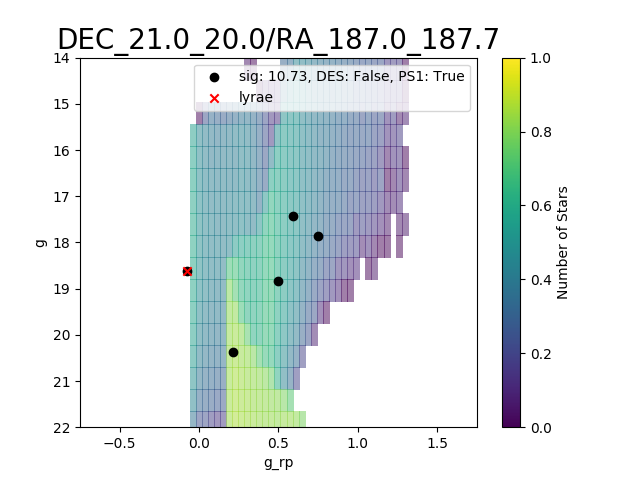
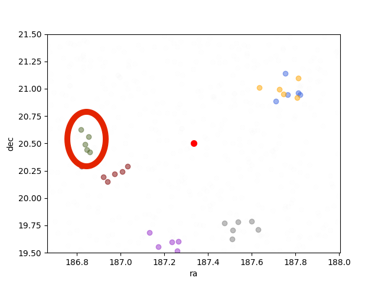 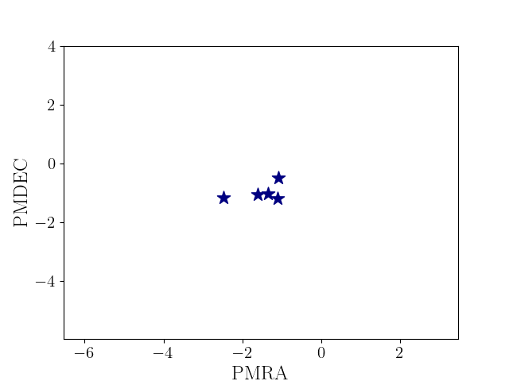

[Data File](https://github.com/edarragh/edarragh.github.io/blob/main/62_corrected.csv)


### Candidate 8
This candidate is likely associated with the Sagittarius stream. The RR Lyrae has been determined to be a member of the stream with high probability (Ramos et al. [2020](https://www.aanda.org/10.1051/0004-6361/202037819)), and distance estimated from the color--magnitude diagram (around 30 kpc) is consistent with the prediction from (Law & Majewski [2010](https://iopscience.iop.org/article/10.1088/0004-637X/714/1/229)). The total measured proper motion in this region of the stream shows significant scatter, so also does not provide much additional information (Antoja et al. [2020](https://www.aanda.org/articles/aa/abs/2020/03/aa37145-19/aa37145-19.html)).
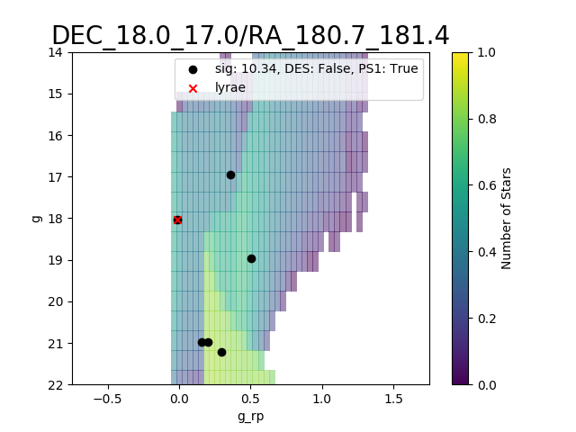
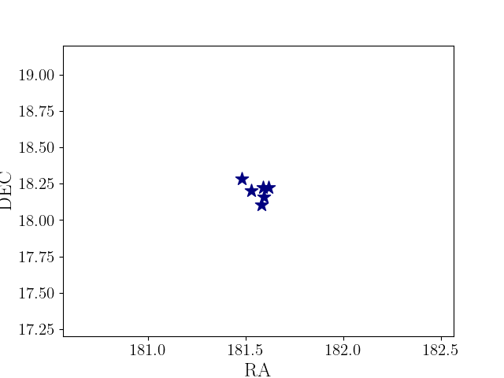 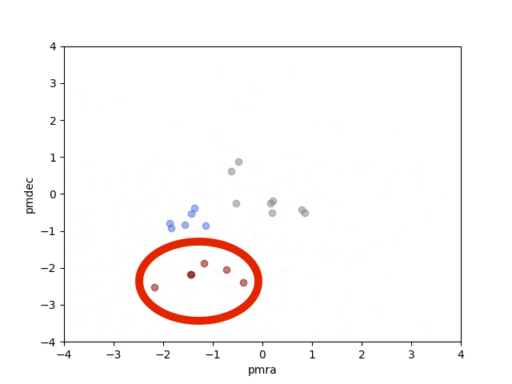

[Data File](https://github.com/edarragh/edarragh.github.io/blob/main/69_corrected.csv)


### Candidate 9
This candidate appears likely to be associated with the PS1-D Stream. Not only does it align closely with the stream's position, but the distance estimated from the RR Lyrae parallax and inferred from the color--magnitude diagram are both consistent with the measured stream distance of 22.9+5.9/-4.7 kpc (Bernard et al. [2016](https://academic.oup.com/mnras/article/463/2/1759/2892775)).
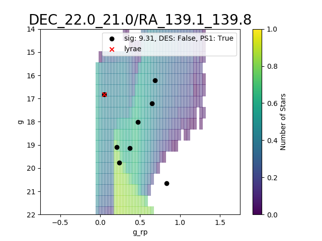
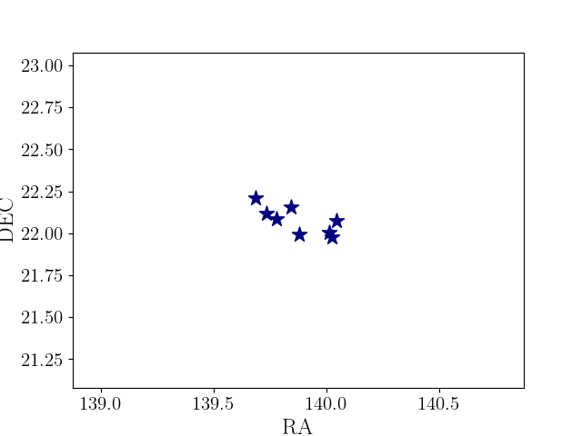 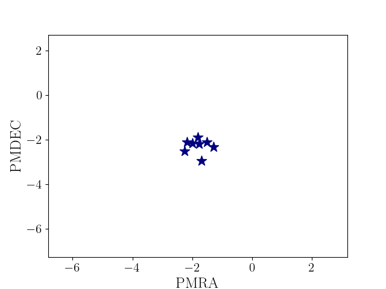

[Data File](https://github.com/edarragh/edarragh.github.io/blob/main/105_corrected.csv)

You can use the [editor on GitHub](https://github.com/edarragh/edarragh.github.io/edit/main/index.md) to maintain and preview the content for your website in Markdown files.

Whenever you commit to this repository, GitHub Pages will run [Jekyll](https://jekyllrb.com/) to rebuild the pages in your site, from the content in your Markdown files.

### Markdown

Markdown is a lightweight and easy-to-use syntax for styling your writing. It includes conventions for

```markdown
Syntax highlighted code block

# Header 1
## Header 2
### Header 3

- Bulleted
- List

1. Numbered
2. List

**Bold** and _Italic_ and `Code` text

[Link](url) and 
```

For more details see [GitHub Flavored Markdown](https://guides.github.com/features/mastering-markdown/).

### Jekyll Themes

Your Pages site will use the layout and styles from the Jekyll theme you have selected in your [repository settings](https://github.com/edarragh/edarragh.github.io/settings). The name of this theme is saved in the Jekyll `_config.yml` configuration file.

### Support or Contact

Having trouble with Pages? Check out our [documentation](https://docs.github.com/categories/github-pages-basics/) or [contact support](https://github.com/contact) and we’ll help you sort it out.
