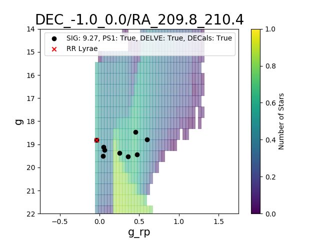
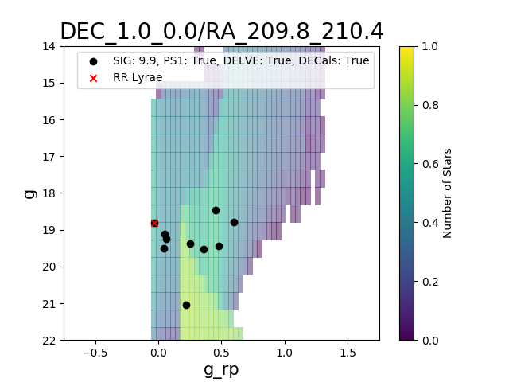
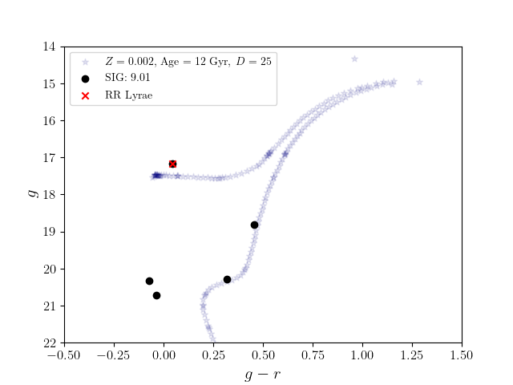
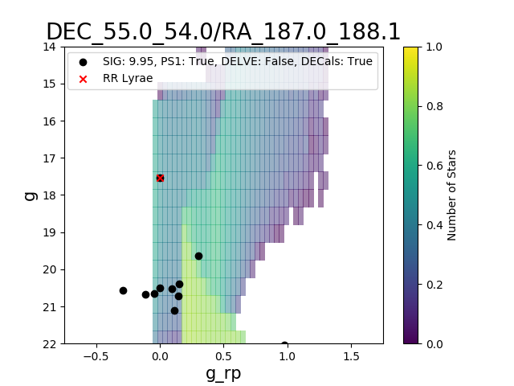
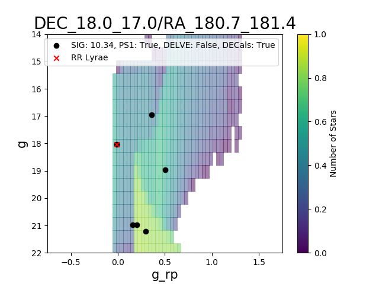
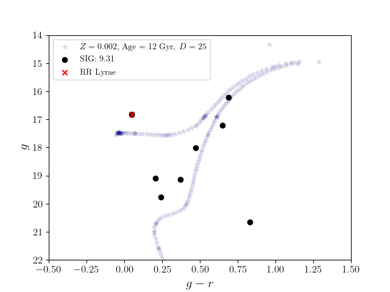

## Full Candidate List 

Columns      | Description
------------ | -------------
ID | candidate number
significance | wavelet significance (Darragh-Ford et al. 2020)
RA | degrees
DEC | degrees
l | degrees
b | degrees
DES_FOOTPRINT | TRUE if in DES Footprint 
PS1_FOOTPRINT | TRUE if in PS1 Footprint 
DELVE_FOOTPRINT | TRUE if in DELVE Footprint 
DECALS_FOOTPRINT | TRUE if in DECals Footprint 
EBV_FLAG | TRUE if E(B-V) > 0.2 
GOLD_STANDARD | TRUE if in "gold standard" candidate list 
RR_LYRAE | TRUE if candidate contains rr lyrae 

[Candidate List](https://github.com/dwarfswaves/dwarfswaves.github.io/blob/main/significance_list_cut_all.csv)

## Gold Standard
[2](2_candidate.csv) [21](21_candidate.csv) [24](24_candidate.csv) [27](27_candidate.csv) [30](30_candidate.csv) [39](39_candidate.csv) [46](46_candidate.csv) [50](50_candidate.csv) [63](63_candidate.csv) [80](80_candidate.csv) [92](92_candidate.csv) [93](93_candidate.csv) [97](97_candidate.csv)
[100](100_candidate.csv) [117](117_candidate.csv) [123](123_candidate.csv) [136](136_candidate.csv) [149](149_candidate.csv) [162](162_candidate.csv) [171](171_candidate.csv) [185](185_candidate.csv) [192](192_candidate.csv)
[205](205_candidate.csv) [242](242_candidate.csv) [251](251_candidate.csv) [253](253_candidate.csv) [254](254_candidate.csv) [262](262_candidate.csv) [267](267_candidate.csv) 
[300](309_candidate.csv) [305](305_candidate.csv) [322](322_candidate.csv) [330](330_candidate.csv) [340](340_candidate.csv) [347](347_candidate.csv) [348](348_candidate.csv) [386](386_candidate.csv) [387](387_candidate.csv) [391](391_candidate.csv) [393](393_candidate.csv) [396](396_candidate.csv) 
[407](407_candidate.csv) [418](418_candidate.csv) [424](424_candidate.csv) [444](444_candidate.csv) [445](445_candidate.csv) [450](450_candidate.csv) [451](451_candidate.csv) [453](453_candidate.csv) [470](470_candidate.csv) [480](480_candidate.csv) [486](486_candidate.csv) [496](496_candidate.csv) [497](497_candidate.csv) [498](498_candidate.csv)
[508](508_candidate.csv) [512](512_candidate.csv) [520](520_candidate.csv) [526](526_candidate.csv) [527](527_candidate.csv) [528](528_candidate.csv) [546](546_candidate.csv) [547](547_candidate.csv) [549](549_candidate.csv) [552](552_candidate.csv) [557](557_candidate.csv) [560](560_candidate.csv) [565](565_candidate.csv) [566](566_candidate.csv) [568](568_candidate.csv) [574](574_candidate.csv) [587](587_candidate.csv) [589](589_candidate.csv) [593](593_candidate.csv)
[609](609_candidate.csv) [621](621_candidate.csv) [630](630_candidate.csv) [640](640_candidate.csv) [652](652_candidate.csv) [664](664_candidate.csv) [674](674_candidate.csv) [675](675_candidate.csv) [686](686_candidate.csv) [697](697_candidate.csv)
[700](700_candidate.csv) [737](737_candidate.csv) [749](749_candidate.csv) [755](755_candidate.csv) [770](770_candidate.csv) [779](779_candidate.csv)
[800](800_candidate.csv) [804](804_candidate.csv) [838](838_candidate.csv) [839](839_candidate.csv) [844](844_candidate.csv) [856](856_candidate.csv)
[900](900_candidate.csv) [904](904_candidate.csv) [930](930_candidate.csv) [947](947_candidate.csv) [968](968_candidate.csv) [973](973_candidate.csv) [986](986_candidate.csv) [997](997_candidate.csv) [998](998_candidate.csv) [999](999_candidate.csv)
[1000](1000_candidate.csv) [1010](1010_candidate.csv) [1013](1013_candidate.csv) [1015](1015_candidate.csv) [1020](1020_candidate.csv) [1022](1022_candidate.csv)

## RR Lyrae 
[78](78_candidate.csv) [94](94_candidate.csv) [109](109_candidate.csv) [335](335_candidate.csv) [363](363_candidate.csv) [389](389_candidate.csv) [400](400_candidate.csv) [401](401_candidate.csv) [414](414_candidate.csv) [420](420_candidate.csv) [436](436_candidate.csv) [442](442_candidate.csv) [456](456_candidate.csv) [457](457_candidate.csv) [461](461_candidate.csv) [468](468_candidate.csv) [511](511_candidate.csv) [599](599_candidate.csv) [665](665_candidate.csv) [758](758_candidate.csv) [824](824_candidate.csv) [841](841_candidate.csv) [846](846_candidate.csv) [913](913_candidate.csv) [942](942_candidate.csv) [978](978_candidate.csv) [1028](1028_candidate.csv) 

## Gold Standard + RR Lyrae Candidates 

### Candidate 1
This candidate is located near the disrupting Pisces I dwarf galaxy. However, the RR Lyrae does not appear to be a confirmed member of Pisces I and the color--magnitude diagram and RR Lyrae parallax distance are more consistent with a closer object (D ~ 20 kpc; Molnár et al. [2015](https://academic.oup.com/mnras/article/452/4/4283/1065787)). 

 

[Data File](https://github.com/dwarfswaves/dwarfswaves.github.io/blob/main/1_candidate_g.csv)

### Candidate 2
This candidate appears near the Styx Stream, which has been interpreted as the tidal tail of the disrupting Boötes III dwarf galaxy (Carlin & Sand [2018](https://iopscience.iop.org/article/10.3847/1538-4357/aad8c1)). However, the average proper motion is inconsistent with the previously measured value for the stream and the stars shown in the color--magnitude diagram are fainter than expected for an object at 45 kpc (Grillmair [2009](https://iopscience.iop.org/article/10.1088/0004-637X/693/2/1118)).

 

[Data File](https://github.com/dwarfswaves/dwarfswaves.github.io/blob/main/2_candidate_g.csv)

### Candidate 3 
This candidate is likely associated with the Sagittarius stream. The RR Lyrae has been determined to be a member of the stream with high probability (Ramos et al. [2020](https://www.aanda.org/10.1051/0004-6361/202037819)), and distance estimated from the color--magnitude diagram (around 60 kpc) is consistent with the prediction from (Law & Majewski [2010](https://iopscience.iop.org/article/10.1088/0004-637X/714/1/229)). The proper motion values are consistent with the Sagittarius stream measurements from (Antoja et al. [2020](https://www.aanda.org/articles/aa/abs/2020/03/aa37145-19/aa37145-19.html)), which predicts μ = 1.0 mas/yr. 

 

[Data File](https://github.com/dwarfswaves/dwarfswaves.github.io/blob/main/3_candidate_g.csv)

### Candidate 4
This candidate is likely associated with the Sagittarius stream. The RR Lyrae has been determined to be a member of the stream with high probability (Ramos et al. [2020](https://www.aanda.org/10.1051/0004-6361/202037819)), and distance estimated from the color--magnitude diagram (around 50 kpc) is consistent with the prediction from (Law & Majewski [2010](https://iopscience.iop.org/article/10.1088/0004-637X/714/1/229)). The proper motion values are consistent with the Sagittarius stream measurements from (Antoja et al. [2020](https://www.aanda.org/articles/aa/abs/2020/03/aa37145-19/aa37145-19.html)), which predicts μ = 1.0 mas/yr.

 

[Data File](https://github.com/dwarfswaves/dwarfswaves.github.io/blob/main/4_candidate_g.csv)

### Candidate 5
This candidate appears near the GD-1 stream at D = 8 kpc (de Boer et al. [2018](https://academic.oup.com/mnras/article-abstract/477/2/1893/4935192?redirectedFrom=fulltext)). However, the color--magnitude diagram is more consistent with an intermediate distance (around 25 kpc), and the RR Lyrae does not appear to be a known associate (Sesar et al. [2013](https://iopscience.iop.org/article/10.1088/0004-6256/146/2/21)).

 

[Data File](https://github.com/dwarfswaves/dwarfswaves.github.io/blob/main/5_candidate_g.csv)

### Candidate 6
This candidate appears near the GD-1 stream at D = 8 kpc (de Boer et al. [2018](https://academic.oup.com/mnras/article-abstract/477/2/1893/4935192?redirectedFrom=fulltext)). However, the color--magnitude diagram is more consistent with an intermediate distance (around 25 kpc), and the RR Lyrae does not appear to be a known associate (Sesar et al. [2013](https://iopscience.iop.org/article/10.1088/0004-6256/146/2/21)).

 

[Data File](https://github.com/dwarfswaves/dwarfswaves.github.io/blob/main/6_candidate_g.csv)

### Candidate 7
This candidate appears near both the Lethe and Sagittarius streams. It is likely associated with the Sagittarius stream as the RR Lyrae has been determined to be a member of the stream with high probability (Ramos et al. [2020](https://www.aanda.org/10.1051/0004-6361/202037819)). However, the color--magnitude diagram does not strongly favor or disfavor association with the Sagittarius Stream, which is expected to be at a distance of 30 kpc in this region (Law & Majewski [2010](https://iopscience.iop.org/article/10.1088/0004-637X/714/1/229)). In addition, the color--magnitude diagram is qualitatively different than those returned for known globular clusters recovered by our search (the progenitor of the Lethe Stream is thought to be a globular cluster; (Grillmair [2009](https://iopscience.iop.org/article/10.1088/0004-637X/693/2/1118)). The total measured proper motion in this region of the stream shows significant scatter, so also does not provide much additional information (Antoja et al. [2020](https://www.aanda.org/articles/aa/abs/2020/03/aa37145-19/aa37145-19.html)).

 

[Data File](https://github.com/dwarfswaves/dwarfswaves.github.io/blob/main/7_candidate_g.csv)

### Candidate 8
This candidate is likely associated with the Sagittarius stream. The RR Lyrae has been determined to be a member of the stream with high probability (Ramos et al. [2020](https://www.aanda.org/10.1051/0004-6361/202037819)), and distance estimated from the color--magnitude diagram (around 30 kpc) is consistent with the prediction from (Law & Majewski [2010](https://iopscience.iop.org/article/10.1088/0004-637X/714/1/229)). The total measured proper motion in this region of the stream shows significant scatter, so also does not provide much additional information (Antoja et al. [2020](https://www.aanda.org/articles/aa/abs/2020/03/aa37145-19/aa37145-19.html)).

 

[Data File](https://github.com/dwarfswaves/dwarfswaves.github.io/blob/main/8_candidate_g.csv)

### Candidate 9
This candidate appears likely to be associated with the PS1-D Stream. Not only does it align closely with the stream's position, but the distance estimated from the RR Lyrae parallax and inferred from the color--magnitude diagram are both consistent with the measured stream distance of 22.9+5.9/-4.7 kpc (Bernard et al. [2016](https://academic.oup.com/mnras/article/463/2/1759/2892775)).

 

[Data File](https://github.com/dwarfswaves/dwarfswaves.github.io/blob/main/9_candidate_g.csv)
