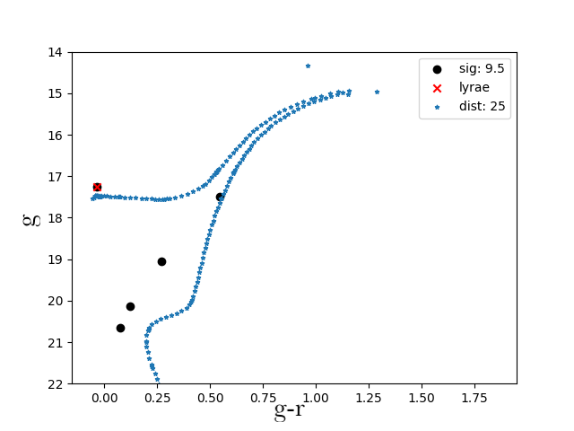

This site hosts a list of candidate dwarf galaxies returned by a comprehensive search in the Gaia DR2 data using an algorihtm based on the wavelet transform. For a more in-depth description see the [full text](https://arxiv.org/abs/2012.00099). The current list has been cross matched with EDR3, but does not contain the full EDR3 analysis. 

## Full Candidate List 

Columns      | Description
------------ | -------------
SIGNIFICANCE | wavelet significance (Darragh-Ford et al. 2020)
RA | degrees
DEC | degrees
l | degrees
b | degrees
DES_FOOTPRINT | TRUE if in DES Footprint 
PS1_FOOTPRINT | TRUE if in PS1 Footprint 
DELVE_FOOTPRINT | TRUE if in DELVE Footprint 
DECALS_FOOTPRINT | TRUE if in DECals Footprint 
EBV_FLAG | TRUE if E(B-V) > 0.2 
PMRA | Average proper motion value (mas/yr)
PMDEC | Average proper motion value (mas/yr)
EDR3 | Significance of cross-matched EDR3 hotspot (0 if no EDR3 hotspot) 
RR_LYRAE | TRUE if candidate contains rr lyrae
NSTARS | Number of stars in candidate 
MAG_AVG | Average magnitude of stars in candidate 
MAG_MAX| Magnitude of brightest star in candidate 

[Gold Standard with RR Lyrae Candidate List](https://github.com/dwarfswaves/dwarfswaves.github.io/blob/main/CANDIDATE_LISTS/candidate_list_gold_standard_rr_lyrae.csv)

[Gold Standard Candidate List](https://github.com/dwarfswaves/dwarfswaves.github.io/blob/main/CANDIDATE_LISTS/candidate_list_gold_standard.csv)

[Clean Candidate List](https://github.com/dwarfswaves/dwarfswaves.github.io/blob/main/CANDIDATE_LISTS/candidate_list_clean.csv)

## Gold Standard + RR Lyrae Candidates 

### Candidate 1
This candidate is located near the disrupting Pisces I dwarf galaxy. However, the RR Lyrae does not appear to be a confirmed member of Pisces I and the color--magnitude diagram and RR Lyrae parallax distance are more consistent with a closer object (D ~ 20 kpc; Molnár et al. [2015](https://academic.oup.com/mnras/article/452/4/4283/1065787)). 

 

[Data File](https://github.com/dwarfswaves/dwarfswaves.github.io/blob/main/1_candidate_g.csv)

### Candidate 2
This candidate appears near the Styx Stream, which has been interpreted as the tidal tail of the disrupting Boötes III dwarf galaxy (Carlin & Sand [2018](https://iopscience.iop.org/article/10.3847/1538-4357/aad8c1)). However, the average proper motion is inconsistent with the previously measured value for the stream and the stars shown in the color--magnitude diagram are fainter than expected for an object at 45 kpc (Grillmair [2009](https://iopscience.iop.org/article/10.1088/0004-637X/693/2/1118)).

 

[Data File](https://github.com/dwarfswaves/dwarfswaves.github.io/blob/main/2_candidate_g.csv)
