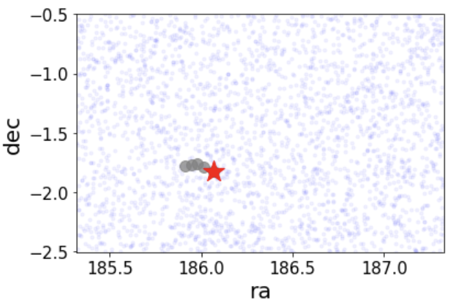

This site hosts a list of candidate dwarf galaxies returned by a comprehensive search in the Gaia DR2 data using an algorihtm based on the wavelet transform. For a more in-depth description see the [full text](https://arxiv.org/abs/2012.00099). The current list has been cross matched with EDR3, but does not contain the full EDR3 analysis. 

## Code implementation for wavelet transform pipeline available at: [demeter](https://github.com/edarragh/demeter)

## Full Candidate List 

Columns      | Description
------------ | -------------
SIGNIFICANCE | wavelet significance (Darragh-Ford et al. 2020)
RA | degrees
DEC | degrees
l | degrees
b | degrees
DES_FOOTPRINT | TRUE if in DES Footprint 
PS1_FOOTPRINT | TRUE if in PS1 Footprint 
DELVE_FOOTPRINT | TRUE if in DELVE Footprint 
DECALS_FOOTPRINT | TRUE if in DECals Footprint 
EBV_FLAG | TRUE if E(B-V) > 0.2 
PMRA | Average proper motion value (mas/yr)
PMDEC | Average proper motion value (mas/yr)
EDR3 | Significance of cross-matched EDR3 hotspot (0 if no EDR3 hotspot) 
RR_LYRAE | TRUE if candidate contains rr lyrae
NSTARS | Number of stars in candidate 
MAG_AVG | Average magnitude of stars in candidate 
MAG_MAX| Magnitude of brightest star in candidate 

[Gold Standard with RR Lyrae Candidate List](https://github.com/dwarfswaves/dwarfswaves.github.io/blob/main/CANDIDATE_LISTS/candidate_list_gold_standard_rr_lyrae.csv)

[Gold Standard Candidate List](https://github.com/dwarfswaves/dwarfswaves.github.io/blob/main/CANDIDATE_LISTS/candidate_list_gold_standard.csv)

[Clean Candidate List](https://github.com/dwarfswaves/dwarfswaves.github.io/blob/main/CANDIDATE_LISTS/candidate_list_clean.csv)

**NEW** [FUll EDR3 Candidate List](https://github.com/dwarfswaves/dwarfswaves.github.io/blob/main/CANDIDATE_LISTS/candidate_list_edr3_all.csv)

## Gold Standard + RR Lyrae Candidates 

### Candidate 1
This candidate is not associated with any known dwarfs or globular clusters. However, it is near the Orion molecular complex making dust contamination a potential issue for both Gaia completeness in the region and the interpretation of stellar colors and magnitudes due to extinction uncertainties (Rezaei et al. [2018](https://www.aanda.org/articles/aa/full_html/2018/08/aa32503-17/aa32503-17.html)). 

 

[Data File](https://github.com/dwarfswaves/dwarfswaves.github.io/blob/main/candidate_1.csv)

### Candidate 2
This candidate is likely associated with the Virgo Stellar Stream. The distance of the stream (19 kpc) broadly agrees with the color--magnitude distribution of candidate stars and the associated RR Lyrae has been previously associated with the stream (Prior et al. [2009](https://iopscience.iop.org/article/10.1088/0004-637X/691/1/306)).

 

[Data File](https://github.com/dwarfswaves/dwarfswaves.github.io/blob/main/candidate_1.csv)
