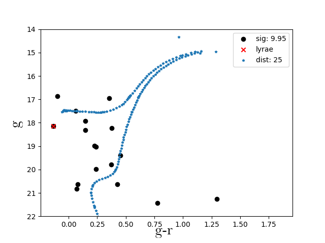

This site hosts a list of candidate dwarf galaxies returned by a comprehensive search in the Gaia DR2 data using an algorihtm based on the wavelet transform. For a more in-depth description see the [full text](https://arxiv.org/abs/2012.00099). The current list has been cross matched with EDR3, but does not contain the full EDR3 analysis. 

## Full Candidate List 

Columns      | Description
------------ | -------------
SIGNIFICANCE | wavelet significance (Darragh-Ford et al. 2020)
RA | degrees
DEC | degrees
l | degrees
b | degrees
DES_FOOTPRINT | TRUE if in DES Footprint 
PS1_FOOTPRINT | TRUE if in PS1 Footprint 
DELVE_FOOTPRINT | TRUE if in DELVE Footprint 
DECALS_FOOTPRINT | TRUE if in DECals Footprint 
EBV_FLAG | TRUE if E(B-V) > 0.2 
PMRA | Average proper motion value (mas/yr)
PMDEC | Average proper motion value (mas/yr)
EDR3 | Significance of cross-matched EDR3 hotspot (0 if no EDR3 hotspot) 
RR_LYRAE | TRUE if candidate contains rr lyrae
NSTARS | Number of stars in candidate 
MAG_AVG | Average magnitude of stars in candidate 
MAG_MAX| Magnitude of brightest star in candidate 

[Gold Standard with RR Lyrae Candidate List](https://github.com/dwarfswaves/CANDIDATE_LISTS/candidate_list_gold_standard_with_rrlyrae.csv)

[Gold Standard Candidate List](https://github.com/dwarfswaves/CANDIDATE_LISTS/dwarfswaves.github.io/blob/main/candidate_list_gold_standard.csv)

[Clean Candidate List](https://github.com/dwarfswaves/CANDIDATE_LISTS/candidate_list_clean.csv)

## Gold Standard + RR Lyrae Candidates 

### Candidate 1
This candidate is located near the disrupting Pisces I dwarf galaxy. However, the RR Lyrae does not appear to be a confirmed member of Pisces I and the color--magnitude diagram and RR Lyrae parallax distance are more consistent with a closer object (D ~ 20 kpc; Molnár et al. [2015](https://academic.oup.com/mnras/article/452/4/4283/1065787)). 

 

[Data File](https://github.com/dwarfswaves/dwarfswaves.github.io/blob/main/1_candidate_g.csv)

### Candidate 2
This candidate appears near the Styx Stream, which has been interpreted as the tidal tail of the disrupting Boötes III dwarf galaxy (Carlin & Sand [2018](https://iopscience.iop.org/article/10.3847/1538-4357/aad8c1)). However, the average proper motion is inconsistent with the previously measured value for the stream and the stars shown in the color--magnitude diagram are fainter than expected for an object at 45 kpc (Grillmair [2009](https://iopscience.iop.org/article/10.1088/0004-637X/693/2/1118)).

 

[Data File](https://github.com/dwarfswaves/dwarfswaves.github.io/blob/main/2_candidate_g.csv)

### Candidate 3 
This candidate is likely associated with the Sagittarius stream. The RR Lyrae has been determined to be a member of the stream with high probability (Ramos et al. [2020](https://www.aanda.org/10.1051/0004-6361/202037819)), and distance estimated from the color--magnitude diagram (around 60 kpc) is consistent with the prediction from (Law & Majewski [2010](https://iopscience.iop.org/article/10.1088/0004-637X/714/1/229)). The proper motion values are consistent with the Sagittarius stream measurements from (Antoja et al. [2020](https://www.aanda.org/articles/aa/abs/2020/03/aa37145-19/aa37145-19.html)), which predicts μ = 1.0 mas/yr. 

 

[Data File](https://github.com/dwarfswaves/dwarfswaves.github.io/blob/main/3_candidate_g.csv)

### Candidate 4
This candidate is likely associated with the Sagittarius stream. The RR Lyrae has been determined to be a member of the stream with high probability (Ramos et al. [2020](https://www.aanda.org/10.1051/0004-6361/202037819)), and distance estimated from the color--magnitude diagram (around 50 kpc) is consistent with the prediction from (Law & Majewski [2010](https://iopscience.iop.org/article/10.1088/0004-637X/714/1/229)). The proper motion values are consistent with the Sagittarius stream measurements from (Antoja et al. [2020](https://www.aanda.org/articles/aa/abs/2020/03/aa37145-19/aa37145-19.html)), which predicts μ = 1.0 mas/yr.

 

[Data File](https://github.com/dwarfswaves/dwarfswaves.github.io/blob/main/4_candidate_g.csv)

### Candidate 5
This candidate appears near the GD-1 stream at D = 8 kpc (de Boer et al. [2018](https://academic.oup.com/mnras/article-abstract/477/2/1893/4935192?redirectedFrom=fulltext)). However, the color--magnitude diagram is more consistent with an intermediate distance (around 25 kpc), and the RR Lyrae does not appear to be a known associate (Sesar et al. [2013](https://iopscience.iop.org/article/10.1088/0004-6256/146/2/21)).

 

[Data File](https://github.com/dwarfswaves/dwarfswaves.github.io/blob/main/5_candidate_g.csv)

### Candidate 6
This candidate appears near the GD-1 stream at D = 8 kpc (de Boer et al. [2018](https://academic.oup.com/mnras/article-abstract/477/2/1893/4935192?redirectedFrom=fulltext)). However, the color--magnitude diagram is more consistent with an intermediate distance (around 25 kpc), and the RR Lyrae does not appear to be a known associate (Sesar et al. [2013](https://iopscience.iop.org/article/10.1088/0004-6256/146/2/21)).

 

[Data File](https://github.com/dwarfswaves/dwarfswaves.github.io/blob/main/6_candidate_g.csv)

### Candidate 7
This candidate appears near both the Lethe and Sagittarius streams. It is likely associated with the Sagittarius stream as the RR Lyrae has been determined to be a member of the stream with high probability (Ramos et al. [2020](https://www.aanda.org/10.1051/0004-6361/202037819)). However, the color--magnitude diagram does not strongly favor or disfavor association with the Sagittarius Stream, which is expected to be at a distance of 30 kpc in this region (Law & Majewski [2010](https://iopscience.iop.org/article/10.1088/0004-637X/714/1/229)). In addition, the color--magnitude diagram is qualitatively different than those returned for known globular clusters recovered by our search (the progenitor of the Lethe Stream is thought to be a globular cluster; (Grillmair [2009](https://iopscience.iop.org/article/10.1088/0004-637X/693/2/1118)). The total measured proper motion in this region of the stream shows significant scatter, so also does not provide much additional information (Antoja et al. [2020](https://www.aanda.org/articles/aa/abs/2020/03/aa37145-19/aa37145-19.html)).

 

[Data File](https://github.com/dwarfswaves/dwarfswaves.github.io/blob/main/7_candidate_g.csv)

### Candidate 8
This candidate is likely associated with the Sagittarius stream. The RR Lyrae has been determined to be a member of the stream with high probability (Ramos et al. [2020](https://www.aanda.org/10.1051/0004-6361/202037819)), and distance estimated from the color--magnitude diagram (around 30 kpc) is consistent with the prediction from (Law & Majewski [2010](https://iopscience.iop.org/article/10.1088/0004-637X/714/1/229)). The total measured proper motion in this region of the stream shows significant scatter, so also does not provide much additional information (Antoja et al. [2020](https://www.aanda.org/articles/aa/abs/2020/03/aa37145-19/aa37145-19.html)).

 

[Data File](https://github.com/dwarfswaves/dwarfswaves.github.io/blob/main/8_candidate_g.csv)

### Candidate 9
This candidate appears likely to be associated with the PS1-D Stream. Not only does it align closely with the stream's position, but the distance estimated from the RR Lyrae parallax and inferred from the color--magnitude diagram are both consistent with the measured stream distance of 22.9+5.9/-4.7 kpc (Bernard et al. [2016](https://academic.oup.com/mnras/article/463/2/1759/2892775)).

 

[Data File](https://github.com/dwarfswaves/dwarfswaves.github.io/blob/main/9_candidate_g.csv)
